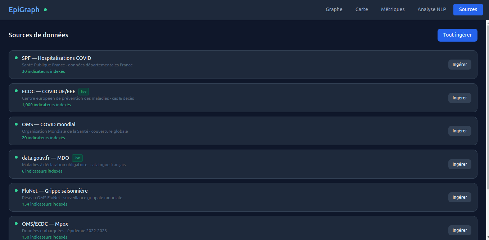
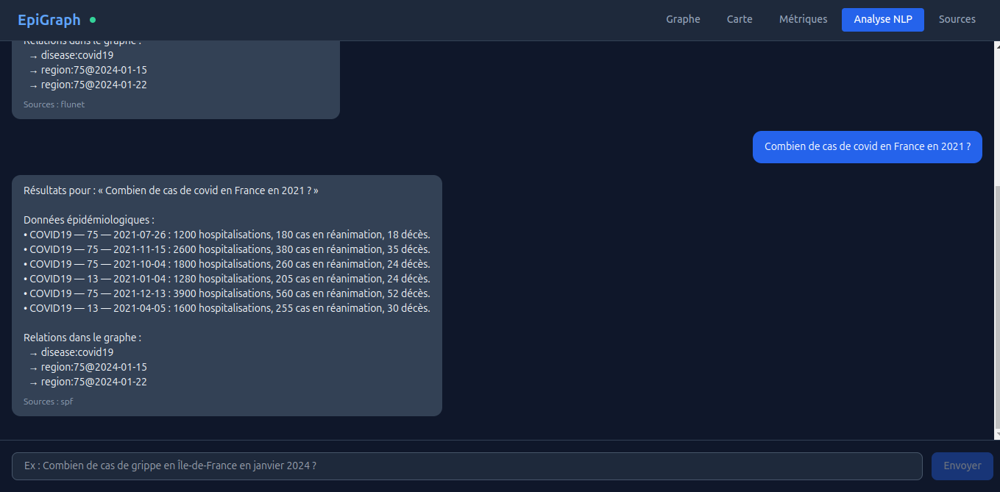
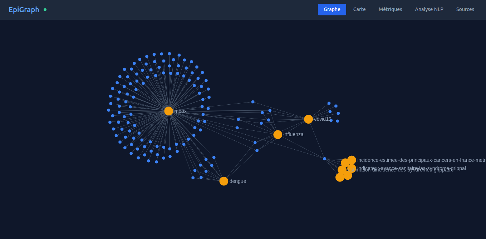
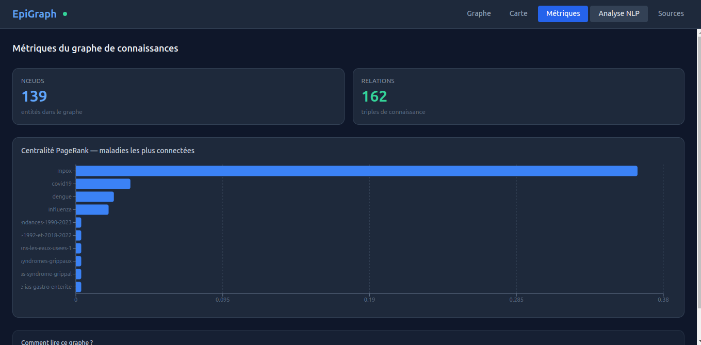

# EpiVec

Plateforme desktop d'analyse épidémiologique par GraphRAG, interrogeable en langage naturel.

Projet d'initiation aux fondamentaux du RAG et du GraphRAG en contexte réel — **sans LLM, sans framework d'orchestration**. La pipeline est écrite à la main pour rendre visible chaque étape.

---

## Prérequis

- [Docker](https://docs.docker.com/get-docker/) & Docker Compose
- [Node.js](https://nodejs.org/) ≥ 20 (frontend Electron)
- Python ≥ 3.11 (tests et développement local backend)

---

## Démarrage rapide

### 1. Variables d'environnement

```bash
cp .env.example .env
```

Le fichier `.env.example` est prêt pour Docker Compose — les hostnames `postgres` et `chromadb` correspondent aux noms de services internes. Ne pas changer sauf si tu lances le backend hors Docker.

### 2. Lancer les services

```bash
# Production (PostgreSQL + ChromaDB + backend)
docker compose up -d

# Développement avec hot-reload backend
docker compose -f docker-compose.yml -f docker-compose.dev.yml up
```

Au démarrage, le backend exécute automatiquement `alembic upgrade head` pour créer les tables.

### 3. Vérifier que le backend répond

```bash
curl http://localhost:8000/health
# {"status": "ok"}
```

### 4. Lancer l'app Electron

```bash
cd electron
npm install
npm run dev
```

L'app se connecte à `http://localhost:8000`. L'indicateur dans le header passe au vert quand le backend est joignable.

---

## Guide d'utilisation

L'app Electron expose 5 vues accessibles depuis la barre de navigation : **Graphe**, **Carte**, **Métriques**, **Analyse NLP**, **Sources**.

### Sources — gérer l'ingestion des données



L'onglet **Sources** liste toutes les sources épidémiologiques disponibles avec leur statut (point vert = données déjà ingérées), le nombre d'indicateurs indexés, et un badge `live` pour les sources interrogées en temps réel. Deux actions sont disponibles :

- **Ingérer** (par source) — déclenche l'ingestion d'une source spécifique.
- **Tout ingérer** (en haut à droite) — ingère toutes les sources en une seule action.

> Commencer par cette vue avant d'utiliser les autres onglets — le graphe et la recherche NLP sont vides tant qu'aucune source n'est ingérée.

### Analyse NLP — interroger en langage naturel



L'onglet **Analyse NLP** est l'interface principale de recherche. Il suffit de taper une question en français dans le champ en bas (ex. : *« Combien de cas de covid en France en 2021 ? »*) et d'appuyer sur **Envoyer**.

La réponse est structurée en deux parties :
- **Données épidémiologiques** — indicateurs chiffrés extraits des sources (hospitalisations, réanimations, décès, par région et date).
- **Relations dans le graphe** — triples de connaissance reliant la maladie aux régions et dates trouvées.

Chaque réponse indique la source utilisée (ex. : `spf`, `flunet`).

### Graphe — explorer le graphe de connaissances



L'onglet **Graphe** affiche le graphe de connaissances construit à partir des données ingérées, rendu avec Sigma.js :

- **Nœuds orange** — entités maladies (mpox, covid19, influenza, dengue…).
- **Nœuds bleus** — entités associées (régions, dates, datasets).
- **Arêtes** — triples de connaissance (relations `has_hospitalizations_in`, `reported_in`…).

Le graphe est interactif : déplacer, zoomer, et cliquer sur un nœud pour explorer ses voisins.

### Métriques — analyser la structure du graphe



L'onglet **Métriques** expose les statistiques structurelles du graphe :

- **Nœuds** — nombre total d'entités dans le graphe.
- **Relations** — nombre total de triples de connaissance.
- **Centralité PageRank** — classement des maladies les plus connectées dans le graphe. Une maladie avec un score PageRank élevé est reliée à davantage de régions, dates et indicateurs, ce qui signifie que les requêtes NLP la concernant bénéficient de plus de contexte graphe.

---

## Ingestion des données

L'ingestion est manuelle — elle télécharge les sources publiques, calcule les embeddings localement et construit le graphe de connaissances.

```bash
# Ingérer une source spécifique
curl -X POST http://localhost:8000/ingest/spf
curl -X POST http://localhost:8000/ingest/ecdc
curl -X POST http://localhost:8000/ingest/who
curl -X POST http://localhost:8000/ingest/data_gouv

# Tout ingérer en une fois
curl -X POST http://localhost:8000/ingest/
```

| Source | Données |
|---|---|
| `spf` | Hospitalisations COVID par département (Santé Publique France) |
| `ecdc` | Cas et décès COVID par pays UE/EEE |
| `who` | Cas et décès COVID mondiaux |
| `data_gouv` | Datasets épidémiologiques génériques |

---

## API

| Méthode | Route | Description |
|---|---|---|
| `GET` | `/health` | Statut du backend |
| `POST` | `/ingest/{source}` | Déclencher l'ingestion d'une source |
| `POST` | `/ingest/` | Ingérer toutes les sources |
| `POST` | `/query/` | Interroger en langage naturel |
| `GET` | `/graph/` | Export du sous-graphe (filtres : `disease`, `region`, `depth`) |
| `GET` | `/graph/stats` | Métriques du graphe (PageRank, taille) |

### Exemple de requête NLP

```bash
curl -X POST http://localhost:8000/query/ \
  -H "Content-Type: application/json" \
  -d '{"question": "Combien de cas de covid en Île-de-France ?"}'
```

```json
{
  "answer": "Résultats pour : « Combien de cas de covid en Île-de-France ? »\n\nDonnées épidémiologiques :\n• disease:covid19 has_hospitalizations_in region:75@2024-01-15",
  "sources": ["spf"],
  "entities": {"diseases": ["covid19"], "regions": ["Île-de-France"], "dates": [], "metrics": []},
  "intent": "query"
}
```

---

## Pipeline RAG/GraphRAG

```
Question utilisateur
  │
  ├── spaCy NER              → entités extraites (maladie, région, date)
  ├── sentence-transformers  → embedding local de la question
  │
  ├── ChromaDB               → top-k chunks sémantiquement proches  (retrieval vectoriel)
  └── NetworkX               → voisins des entités dans le graphe    (retrieval graphe)
                    │
                    └── answer_builder → réponse structurée par template (sans LLM)
```

**Ingestion :**
```
données brutes → chunker (~200 tokens) → sentence-transformers → ChromaDB
             → normalizer             → triples              → PostgreSQL + NetworkX
```

---

## Tests

```bash
cd backend

# Créer et activer le venv
python3 -m venv .venv
source .venv/bin/activate

# Installer les dépendances
pip install -r requirements.txt
python -m spacy download fr_core_news_lg

# Lancer les tests
pytest -v
```

Les tests d'intégration (`test_api.py`) utilisent ASGI transport et mockent PostgreSQL, ChromaDB et NetworkX — aucune infrastructure nécessaire.

---

## Structure du projet

```
EpiVec/
├── backend/
│   ├── app/
│   │   ├── api/routes/       # query.py, graph.py, ingest.py
│   │   ├── core/             # config.py, database.py
│   │   ├── graph/            # builder.py, traversal.py, features.py
│   │   ├── ingestion/        # pipeline.py, chunker.py, normalizer.py, sources/
│   │   ├── models/           # Triple, Region, Indicator
│   │   ├── nlp/              # extractor.py (spaCy NER), intent.py
│   │   └── rag/              # embedder.py, retriever.py, answer_builder.py
│   ├── migrations/           # Alembic — schéma PostgreSQL versionné
│   ├── tests/                # test_api.py (intégration), test_units.py (unitaires)
│   ├── Dockerfile
│   └── requirements.txt
├── electron/
│   ├── src/
│   │   ├── components/       # ChatPanel, GraphView, Dashboard, MapView
│   │   ├── api/client.ts     # Appels HTTP vers le backend
│   │   └── store/index.ts    # État global Zustand
│   └── package.json
├── docker-compose.yml
├── docker-compose.dev.yml
└── .env.example
```

---

## Stack

| Couche | Technologie | Rôle |
|---|---|---|
| Frontend | Electron + React + Sigma.js | UI desktop, graphe interactif, chat NLP |
| Backend | FastAPI (Python) | API REST, pipeline RAG/GraphRAG |
| Base de données | PostgreSQL + Alembic | Triples de connaissance, indicateurs |
| Vecteurs | ChromaDB | Embeddings + recherche cosinus |
| Embeddings | sentence-transformers | Calcul local (`paraphrase-multilingual-MiniLM-L12-v2`) |
| Graphe | NetworkX | Graphe en mémoire, traversal, PageRank |
| NLP | spaCy (`fr_core_news_lg`) | NER — extraction maladie, région, date |
| Conteneurisation | Docker Compose | Backend + PostgreSQL + ChromaDB |

**Absent volontairement :** LLM (Claude, Ollama, OpenAI), LangChain, LlamaIndex, analyse prédictive ML.
